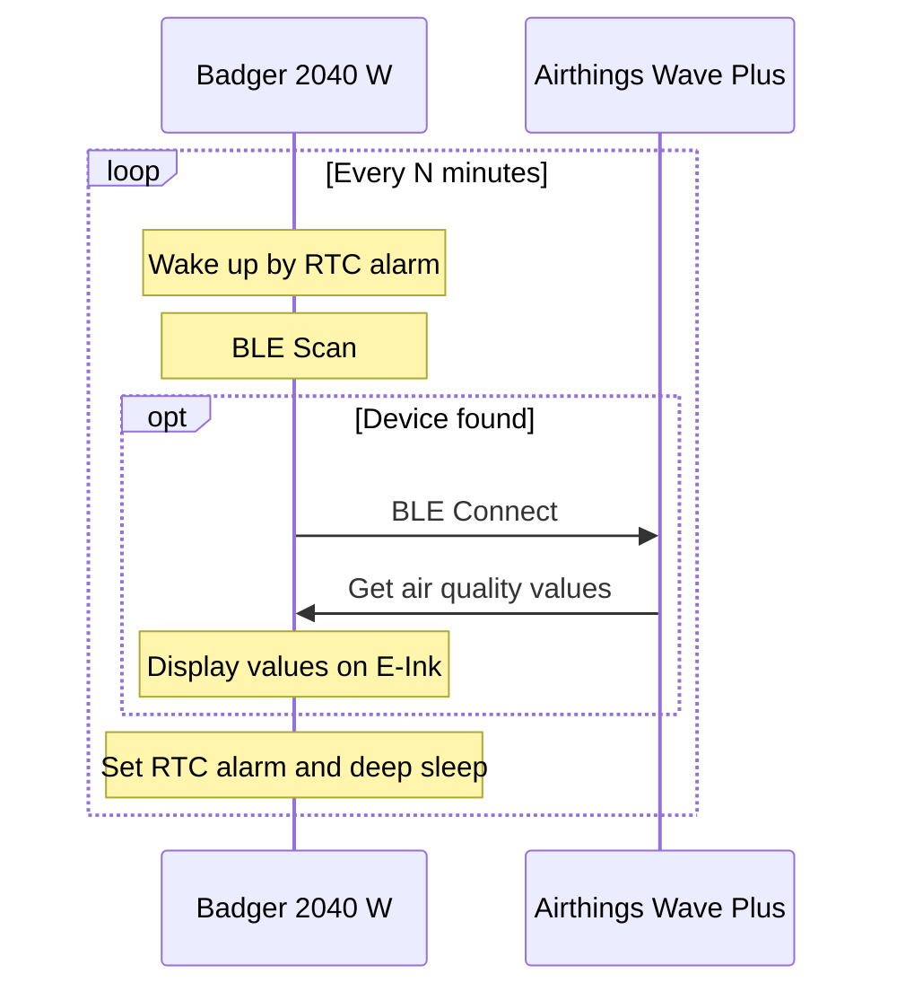

# TRAWM - T Rust Air Wireless Monitoring
trawm is the firmware for [Pimoroni Badger 2040 W](https://shop.pimoroni.com/products/badger-2040-w) for air quality monitoring using [Airthings Wave Plus](https://www.airthings.com/wave-plus) via Bluetooth LE.
It doesn't require any additional settings, just install & run.

It's supposed to be energy efficient and work on AA/AAA batteries for months/years

# License
trawm is licensed under Apache License, Version 2.0 ([LICENSE](LICENSE) or <http://www.apache.org/licenses/LICENSE-2.0>)

# How it works

# How it looks

# How to flash the Badger 2040 W
- Clone this repo
- Install **rust** + **cargo** using **rustup**: <https://rustup.rs>
- Install **elf2uf2-rs**: `cargo install elf2uf2-rs`
- Connect Badger 2040 W
- Switch it to the boot-loader mode (Hold **reset** + **bootsel** buttons together, the **RPI-RP2** virtual disc should appear)
- Run `cargo build --release && cargo uf2-deploy` in project dir